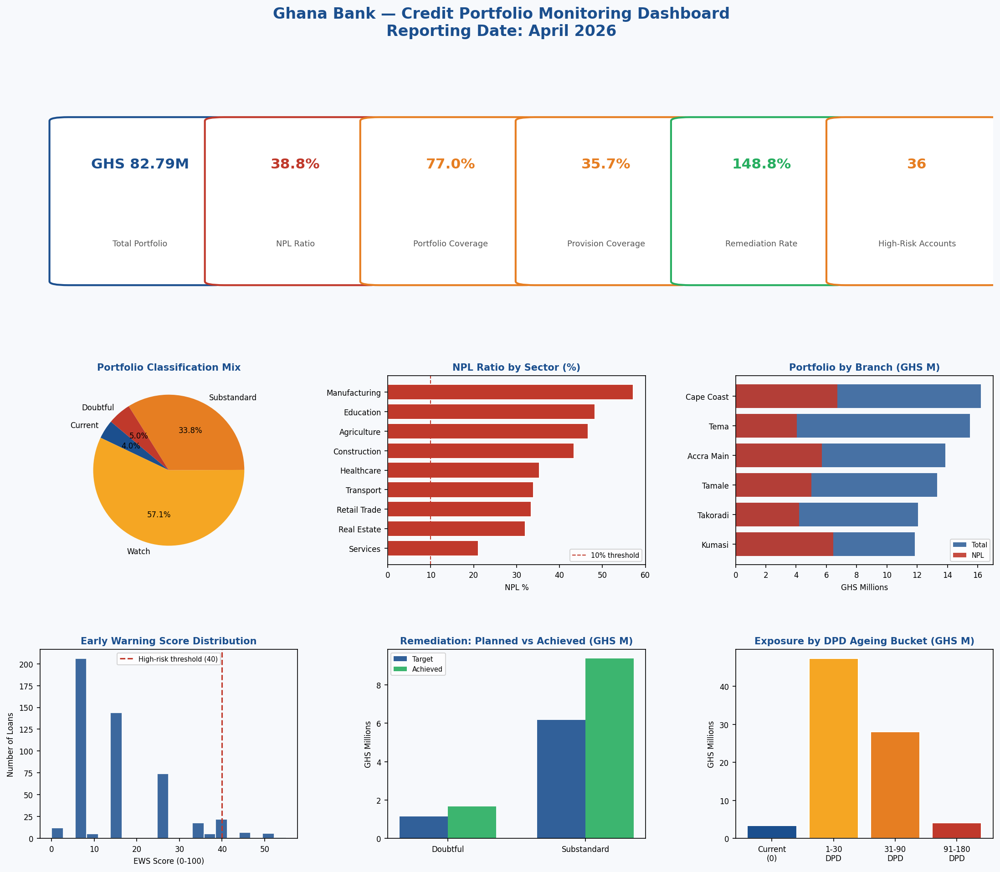

# 🏦 Ghana Bank — Credit Portfolio Monitoring System

> A Python-based credit monitoring analytics system replicating the core workflows of a bank Credit Monitoring Officer: NPL tracking, portfolio classification, early warning scoring, provision analysis, and automated report generation.

---

## 📊 Dashboard Preview



---

## 🎯 What This Project Does

This project simulates the analytical environment of a bank credit monitoring function and directly addresses the KPIs used to evaluate a Credit Monitoring Officer:

| JD KPI | Implementation |
|---|---|
| **NPL as % of Total Loans** | Computed and tracked by classification bucket |
| **Quality & Number of Reviews / Portfolio Coverage** | Review completion rate calculated per account |
| **Timely Delivery & Quality of Monitoring Reports** | Automated CSV monitoring reports generated on run |
| **Planned vs. Achieved Improvement Process Initiative** | Remediation target vs. achieved tracking by class |
| **Reduction in Impaired Assets / Bad Debt Portfolio** | Remediation value analysis with sector breakdown |
| **Remediation Value to Staff Cost** | Proxy ratio computed against estimated staff cost base |

---

## 🔬 Analytical Modules

### 1. Portfolio Classification & NPL Ratio Tracking
Classifies the full loan portfolio using the Bank of Ghana 5-tier system:
- **Current** → 1% provision
- **Watch** → 5% provision
- **Substandard** → 25% provision
- **Doubtful** → 50% provision
- **Loss** → 100% provision

Calculates NPL ratio, provision adequacy, and collateral coverage per class.

### 2. Sector & Branch Concentration Risk
Identifies which sectors carry the highest NPL ratios and flags concentration risk. Outputs a ranked view of sector exposure for targeted remediation.

### 3. Early Warning Scoring (EWS) Model
A rules-based scoring model (0–100) that flags high-risk accounts based on:
- Days Past Due (DPD) — weighted 40 points
- Collateral Coverage — weighted 30 points
- Provision Rate — weighted 20 points
- Review Completion — weighted 10 points

Outputs a prioritised watchlist for relationship manager action.

### 4. Remediation Tracking — Planned vs. Achieved
Compares improvement targets against realised remediation values by classification class. Computes the Remediation Value to Staff Cost ratio.

### 5. Automated Monitoring Reports
Generates two CSV outputs on every run:
- `monitoring_report_MMMMM_YYYY.csv` — full portfolio view with EWS scores
- `high_risk_watchlist.csv` — prioritised list of flagged accounts

---

## 📁 Project Structure

```
credit_portfolio_monitor/
│
├── generate_data.py          # Synthetic Ghanaian bank portfolio generator (500 loans)
├── credit_monitor.py         # Main monitoring analysis and dashboard
│
├── data/
│   └── loan_portfolio.csv    # Generated loan portfolio dataset
│
├── outputs/
│   ├── credit_monitoring_dashboard.png   # 6-panel monitoring dashboard
│   ├── monitoring_report_april_2026.csv  # Full portfolio monitoring report
│   └── high_risk_watchlist.csv           # EWS-flagged accounts for action
│
└── README.md
```

---

## 🚀 How to Run

```bash
# 1. Clone the repository
git clone https://github.com/[your-username]/credit-portfolio-monitor.git
cd credit-portfolio-monitor

# 2. Install dependencies
pip install pandas numpy matplotlib seaborn scikit-learn

# 3. Generate the synthetic dataset
python generate_data.py

# 4. Run the full monitoring analysis
python credit_monitor.py
```

---

## 📈 Sample Output

```
GHANA BANK — CREDIT PORTFOLIO MONITORING REPORT
Reporting Date: April 2026

KPI                                                Value
--------------------------------------------------------------
Total Loan Portfolio                          GHS 82.79M
NPL Portfolio                                 GHS 32.14M
NPL Ratio (NPL as % of Total Loans)               38.8%
Provision Coverage                                35.7%
Portfolio Reviews Completed                       77.0%
Remediation Value (Planned vs Achieved %)        148.8%
Remediation Value to Staff Cost Ratio             16.5x

SECTOR NPL CONCENTRATION (Top 5 by NPL Ratio)
Sector               NPL Ratio    NPL Exposure   Total Loans
------------------------------------------------------------
Manufacturing            57.2%       GHS 4.87M     GHS 8.51M
Education                48.3%       GHS 4.50M     GHS 9.33M
Agriculture              46.7%       GHS 4.67M     GHS 9.99M
```

---

## 🛠 Tech Stack

- **Python 3.10+**
- **pandas** — data manipulation and portfolio aggregation
- **NumPy** — numerical operations and synthetic data generation
- **matplotlib** — dashboard and visualisation
- **seaborn** — supplementary visualisation styling

---

## 🏛 Domain Context

Built to reflect credit monitoring practice in Ghanaian banking, aligned with:
- **Bank of Ghana Prudential Guidelines** — loan classification criteria
- **Basel II/III credit risk frameworks** — provision rate methodology
- **NIC reporting standards** — portfolio coverage and impairment metrics

---

## 👤 Author

**Ahomka Mills-Robertson**
FMVA® | Commercial & Procurement Analyst | Data Science Practitioner
[LinkedIn](https://linkedin.com/in/ahomkamills) | ahomka1@gmail.com
